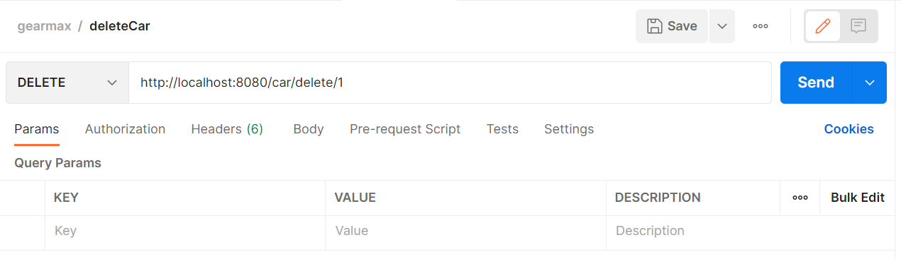

# GearMax-API

GearMax is a web application that helps buyers find the best-fit cars, assists sellers to post their used cars and provides 
price prediction functionalities.

For a lot of reasons such as improving the scalability, we separate the web app into three services: backend, frontend and database. 
The code of the three services is managed in three git repositories. This project, **GearMax-API** is responsible for providing the 
backend service. Specifically, this is a Spring Boot backend project that provides REST APIs to deliver web services.

### Functionality Requirements

Before the reading week, GearMax web app is expected to have the following functionalities:

- Users will see the main page when they input the url of our website. 
- The navigation bar on the main page can direct them to the search page.
- Users can search posts of their interested used cars by filters, and the filters include:
  - price range ([]-[], e.g., 1000-2000)
  - bodyType (SUV_Crossover, Sedan, Coupe, Hatchback, Pickup Truck, Wagon, Minivan, Van, Convertible)
  - make name/brands (Chrysler, Dodge, Mercedes-Benz, Nissan, Honda, Kia, Ford, Lincoln, Audi, Jaguar, Volkswagen, RAM, Porsche, Toyota, INFINITI, GMC, Acura, Maserati,
    FIAT, Volvo, Mitsubishi, Buick, Mercury, Scion, Saab, MINI, Ferrari, Genesis, Saturn, Bentley, Suzuki, Tesla, Fisker, Pontiac, Lamborghini, smart, Hummer)
  - model name (About 541 models given, we may not use this to be the filter) 
  - city (About 80 cities)
  - year range ([]-[], e.g., 2010-2012)
  - mileage ([x], less than or equal to x)
  - exterior color
  - maximum seating ([x], less than or equal to x)
  - transmission display (About 30 transmission display)
  - options/features (not yet implemented)
- When users input a wrong url, our website will always direct them to the search page.
- Users can view the detailed information of a used car when they click a specific post.

After the reading week, GearMax app is expected to have the following functionalities:
- Users can sign in/log in to GearMax.
- Signed users can post their used cars.
- GearMax can predict the future price of used cars by users' given information.

### The 12-Factor Methodology

GearMax follows the 12-factor methodology, which is the best practice for SaaS development, to develop applications that 
run as services.

For more explanations:

[What is the Twelve-Factor App?](https://12factor.net/)

[Twelve-Factor Methodology in a Spring Boot Microservice](https://www.baeldung.com/spring-boot-12-factor)

### Technologies
The technologies that the project uses:
- Spring Boot
- React (gearmax-react-app)
- Spring JPA
- MySQL
- Redis
- Docker

### Project Structure

Use car-related classes as the example:

        com.uw.gearmax.gearmaxapi
         +- GearmaxApiApplication.java
         |
         +- controller
         |   +- viewobject
         |   |    +- CarVO.java
         |   |
         |   +- CarController.java
         |   
         +- domain
         |   +- Car.java
         |
         +- repository
         |   +- CarRepository.java
         |
         +- service
         |   +- impl
         |   |    +- CarServiceImpl.java
         |   +- CarService.java
         |
         +- response
         |
         +- error
         |
         +- validator

The *controller* package includes classes annotated as *@Controller*, which handles HTTP requests. Within each request 
function, you can invoke *service* functions but do not directly invoke *repository* functions.

The *service* package includes interfaces that defines basic behaviors of web services. The *service/impl/* package 
includes classes annotated as *@Service*, which implements the corresponding interfaces and defines the concrete functions.
For example, interface *CarService* specifies the behavior *saveCar()*, then there must be a class titled *CarServiceImpl* 
to implement this function. In each service function, you can invoke *repository* functions to deal with real data.

The *repository* package includes interfaces that extends *CrudRepository* or *JpaRepository*. These interfaces inherently 
implements SQL functions to add/delete/update data, and what we have to do is just calling those APIs such as `carRepository.save(car)` 
in service level.

The *domain* package includes classes annotated as *@Entity*, which are POJOs representing data that can be persisted to
the database. An entity represents a table; for instance, the entity class *Car* represents a table called *Car*.
If you create a new *Car* object and store the object via `carRepository.save(car)`, then a record will be stored in the *Car* table.

The *controller/viewobject* includes classes which represents view objects. Those classes are very similar to entity classes, 
but they are wrapped to only have attributes expected to be displayed to users/developers. In controllers, we only return view 
objects rather than entity objects.

### CI/CD Process

### Environment Requirements
To run this project locally, your environments must meet the following criteria:
- Docker (RECOMMENDED!If u have Docker installed, everything will be super easy!)

If you have Docker installed, please go to [docker-compose running guide](#how-to-run-this-app-in-docker-environment-recommended) to run this app.

or

- Installed JDK (at least 11) and Maven
- MySQL Server 8.0+
- Redis installed

If you haven't Docker installed but have the above three items installed, please go to the [running guide](#how-to-run-this-app-in-either-dev-or-prod-environment) 
to run this app.

### How to run this app in Docker environment? [RECOMMENDED]

Make sure you have Docker installed in your machine. Then go to *gearmax-api/* to run `docker-compose up` or 
`docker-compose up -d` in detached mode to create containers which containerize our apps. If you run this in 
detached mode, run `docker-compose stop` to exit these containerized running apps. 

**Note:** `docker-compose up` will run the file with default name *docker-compose.yml*. This file will create two containers which 
provides spring boot and redis services, and you still can use your local/remote MySQL server only if you configure it correctly. If 
you prefer to use containers to provide MySQL service, you can run `docker-compose -f docker-compose-with-sql.yml up` which will start 
up three containers (spring boot + redis + mysql) configured by *docker-compose-with-sql.yml* (haven't tested yet, hahaha...).

### How to run this app in either dev or prod environment?

**WARNING: If you don't have MySQL or Redis installed, or you do not configure them correctly in the property file, the app will not build or run successfully!**

If you would like to run this app in dev (development) environment, go to *gearmax-api/src/main/resources/application.properties* 
and specify `spring.profiles.active=dev`. This specification will deploy the configurations in *application-dev.properties* when you start your app.

If you would like to run this app in prod (production) environment, find *application.properties* and specify
`spring.profiles.active=prod`. This specification will deploy the configurations in *application-prod.properties* when you start your app.

Then go to *gearmax-api* and run `mvn clean install`.

#### How to configure this app in dev environment, which requires using your own MySQL server?

1. Set up a database named *demo* with MySQL.
2. Find the file *gearmax-api/src/main/resources/application-dev.properties* and change the configuration:
    - spring.datasource.username=[your MySQL username]
    - spring.datasource.password=[your MySQL password]
3. Run *main()* function in *GearmaxApiApplication* class.

#### How to configure this app in prod environment, which requires using the production MySQL server?

If you would like to change the production environment settings/configurations, find *gearmax-api/src/main/resources/application-prod.properties* 
and update the settings.

To avoid leaking sensitive information, we use [Jasypt](https://github.com/ulisesbocchio/jasypt-spring-boot) to do the password encryption. 
Jasypt allows you to only specify the encrypted password in the *application.properties* file. For example, if you would like to 
encrypt a value *'InfoToBeEncrypted'* using the salt *'test'*, you can run command `mvn jasypt:decrypt-value -Djasypt.encryptor.password="test" -Djasypt.plugin.value="InfoToBeEncrypted"`.
You will see the output encrypted value *ENC(/nJHoNctIHpmuaGcmqqUIt5EPw/3/CWzz7RVZrOdhof3NnyvMezwO84n+WdESXLu)*, so you can 
replace the old original password with the encrypted value. Also, do not forget to specify your salt in the property file as well: `jasypt.encryptor.password=test`.

### How to send requests after the app starts?

You can directly send http requests or use Postman. Either way is fine.

**Try searching a car by given parameters**:

`http://localhost:8080/car/list?bodyType=SUV_Crossover&year=2010-2019`

`http://localhost:8080/car/list?bodyType=SUV_Crossover&year=2010-2019&mileage=50000`

**Only add/delete record to your local MySQL databases. Don't perform these operations to the production server.**

**Try adding a car record**:

- use Postman:
  
  
Then you will see the new record in database.
      
**Try deleting a car record**:

- use Postman:

  
### For Contributors 

If you would like to contribute to this project, make a new git branch and work on that branch. Make sure to commit the 
code to the new branch and make a pull request to merge to the main branch.

Before committing the code, always reformat the code. In Intellij IDEA, the formatting shortcut for Windows is **Ctrl+Alt+Shift+L**.

Also, we recommend using SonarLint to fix your code quality issues before your committing the code. Here is the [link](https://www.sonarlint.org/) 
of SonarLint IDE extensions.
